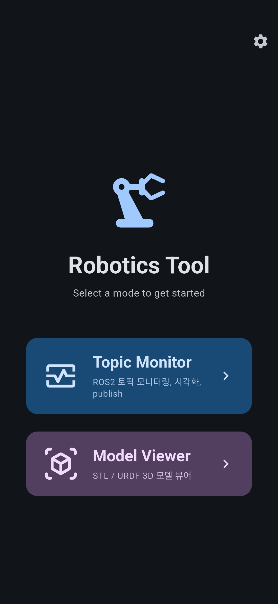
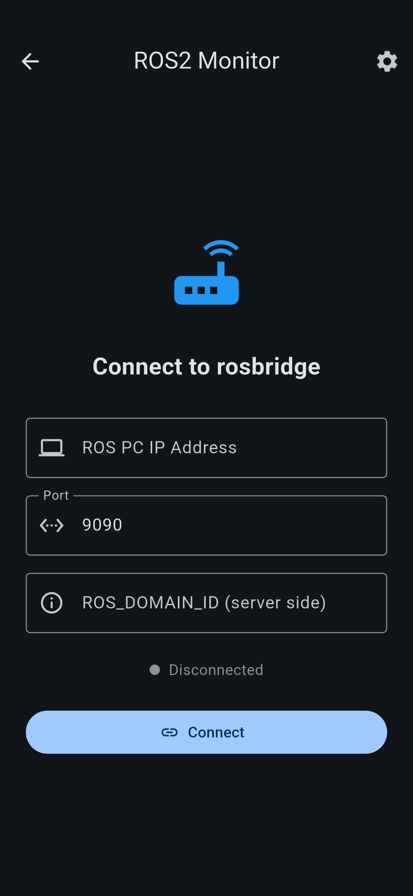
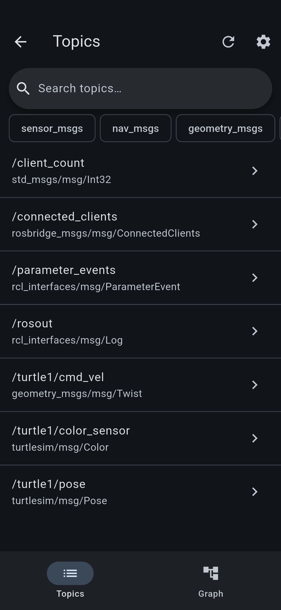
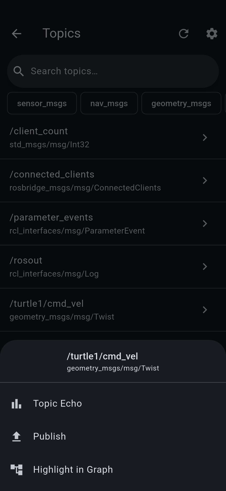
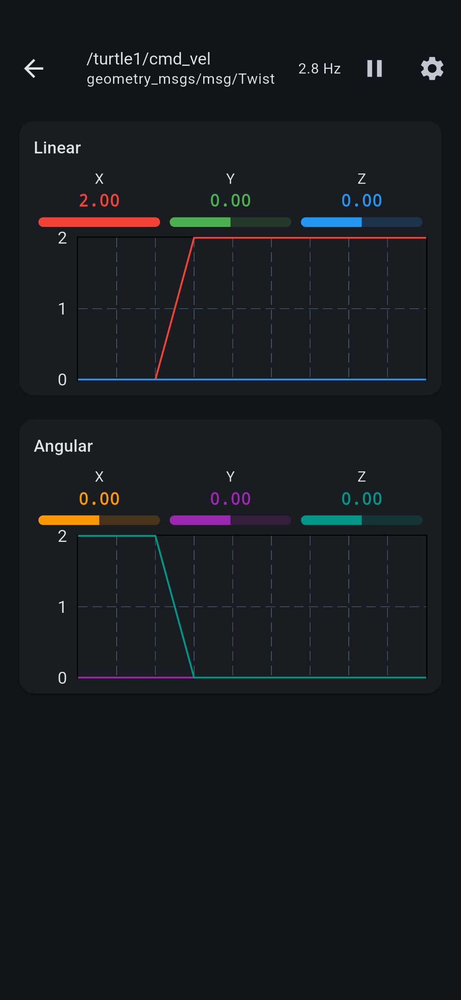
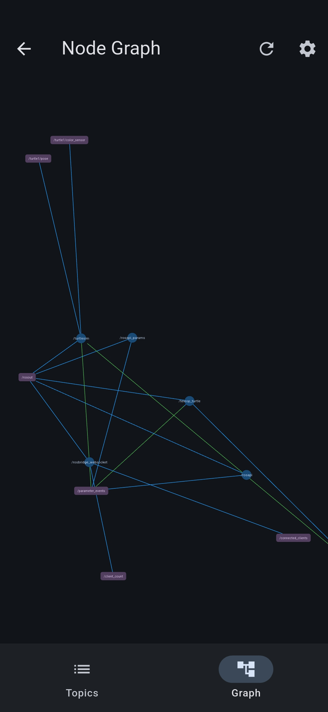
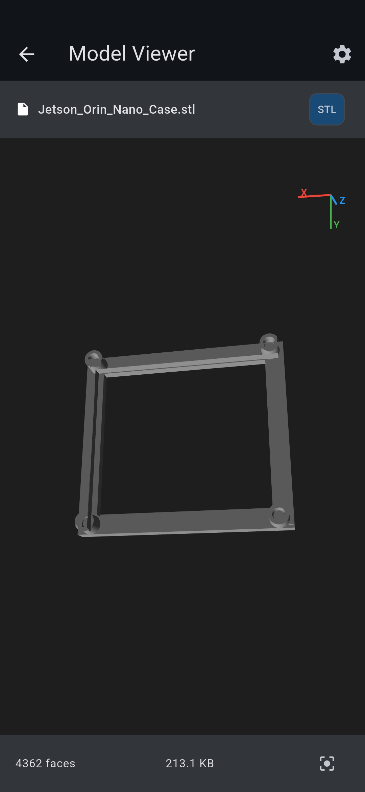

# Robotics Tool

A ROS2 mobile monitoring and visualization app for Android. Connect to a running `rosbridge_server` over WebSocket and monitor your robot in real time.

---

## Features

- **Topic Monitor** — Browse all active ROS2 topics with type filtering and live search
- **Sensor Visualization** — Auto-visualizes LaserScan, Odometry, Twist, Image (raw & compressed), and more
- **Topic Echo** — Subscribe to any topic and stream incoming messages
- **Publish** — Publish messages to any topic with a JSON editor and optional repeat mode
- **Node Graph** — Visualize node-topic connections (force-directed layout)
- **3D Model Viewer** — Load and inspect STL or URDF robot model files

---

## Usage

### 1. Connect to ROS2

Launch the app and enter your PC's IP address and port (default **9090**), then tap **Connect**.

 

---

### 2. Browse Topics

Once connected, open **Topic Monitor** to see all active topics. Use the search bar or filter by message type.

 

---

### 3. Echo & Publish

Select a topic to echo its live messages. To publish, open the **Publish** panel, write your JSON payload, and send — or enable repeat mode for continuous publishing.



**Demo — publishing a topic in real time:**

[](https://youtu.be/dDQ4CdB41EE)
---

### 4. Node Graph

Visualize how nodes and topics are connected in a force-directed graph layout.



---

### 5. 3D Model Viewer

Load STL or URDF files to inspect your robot's physical model.



---

## Setup (ROS2 side)

Install rosbridge:
```bash
sudo apt install ros-humble-rosbridge-suite
```

Launch the WebSocket server:
```bash
ros2 launch rosbridge_server rosbridge_websocket_launch.xml
```

Default port: **9090**

---

## Build from Source

```bash
git clone https://github.com/PolyGon-13/Robotics-Tool.git
cd Robotics-Tool
flutter pub get
flutter run
```

Release APK:
```bash
flutter build apk --release
```

Release AAB (for Play Store):
```bash
flutter build appbundle --release
```

---

## Developer

**PolyGon**
