# Robotics Tool

Check on a ROS2 robot from your phone, without opening a laptop. Robotics Tool connects to a running `rosbridge_server` over WebSocket and shows what your robot is doing in real time: topics, sensor data, the node graph, and your robot model. It can also drive the robot with an on-screen joystick.

**Platform:** Android only.

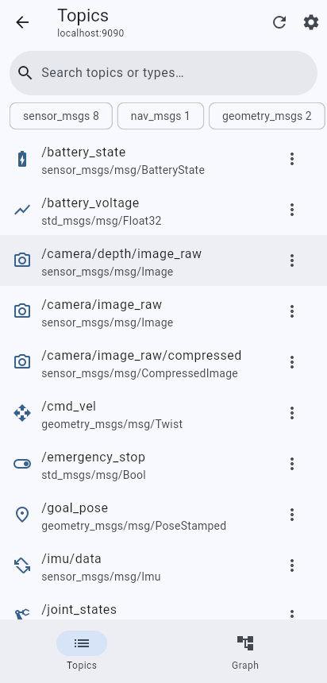 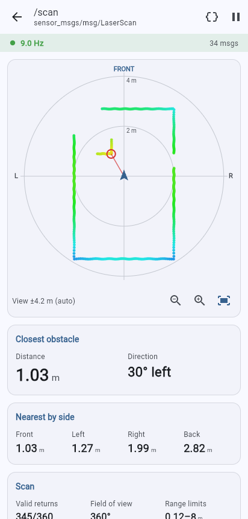 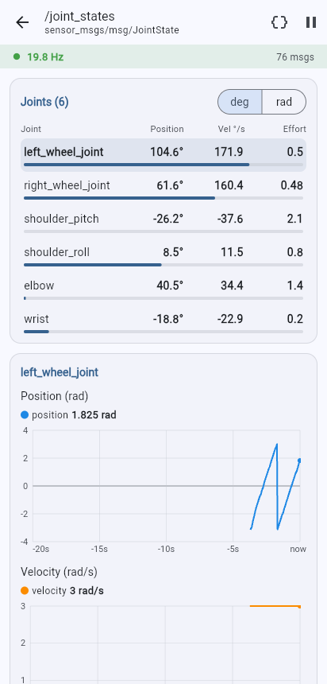 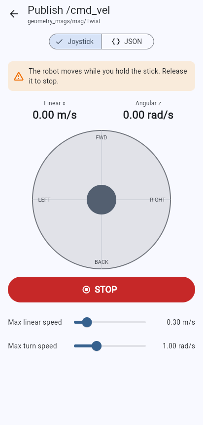

---

## Features

### Connect
- Enter an IP, `host:port`, or paste a `ws://…` URL. The last 5 working addresses are one tap away.
- If a connection fails, the app shows a checklist of the usual causes (rosbridge not running, different Wi-Fi, wrong IP, firewall).
- If the link drops, the app reconnects automatically, shows a banner while it retries, and restores every open topic stream and publisher.
- A link that silently dies, for example when the robot drives out of Wi-Fi range, is detected within about 5 s by a keepalive check. It is not left showing "connected".

### Topic Monitor
- Topics are sorted and searchable by name or type, with filters by message family. System topics (`/rosout`, `/parameter_events`) are hidden until you ask for them.
- Tap a topic to open its live view. Use **⋮** to publish, show it in the graph, or copy its name.
- Every live view shows the **current rate** (Hz, measured over the last few seconds) and warns **"No data for N s"** when a publisher stops.
- A **Raw** toggle shows the message as a JSON tree. Pause freezes the view while the rate keeps being measured.

### Live visualizations

| Message type | What you see |
|---|---|
| `sensor_msgs/LaserScan` | Top-down scan with the robot at the center and forward up, meter rings, pinch zoom, **closest obstacle** distance and direction, nearest distance per side |
| `nav_msgs/Odometry` | Pose (x, y, heading), 1:1 trajectory with the current heading arrow, distance travelled, velocity charts |
| `geometry_msgs/Twist`, `TwistStamped` | Top view of the commanded motion, velocity charts (axes that stay at zero are hidden) |
| `sensor_msgs/Imu` | Artificial horizon, heading dial, roll/pitch/yaw, gyro and accelerometer charts |
| `sensor_msgs/JointState` | One row per joint (position in deg or rad, velocity, effort, range moved so far) and charts for the selected joint |
| `sensor_msgs/BatteryState` | Charge %, charging status, health, voltage/current/temperature, cell voltages, voltage history |
| `sensor_msgs/Range` | Distance with "clear" / "too close" states and history |
| `sensor_msgs/Image`, `CompressedImage` | Camera view with pinch zoom; depth images (`16UC1`, `mono16`, `32FC1`) are shown with a color map |
| `tf2_msgs/TFMessage` | Frame tree with each frame's offset, yaw, and time since its last update |
| Pose, Point, Vector3, Quaternion, Pose2D families | Values with orientation as roll/pitch/yaw, plus history |
| `std_msgs` numbers and arrays, Temperature, Pressure, … | Current value, min/max/average, 30 s chart |
| `std_msgs/String`, `Bool` | Current value and a timestamped log of changes |

Charts share one style: a real time axis, a legend with the live value and unit, and x/y/z colored red/green/blue as in RViz. Any other message type opens as a JSON tree.

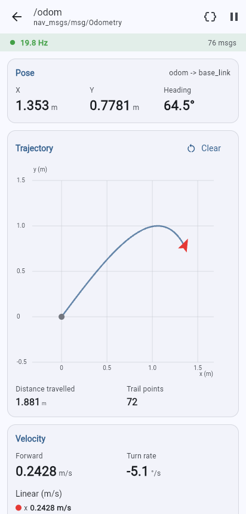 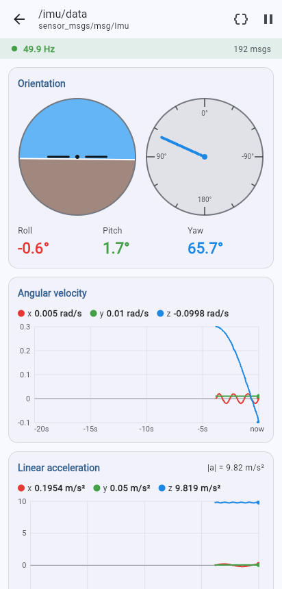 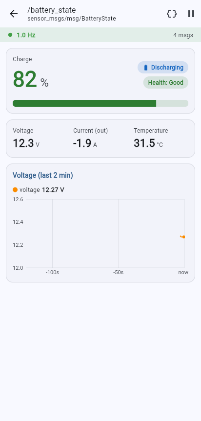 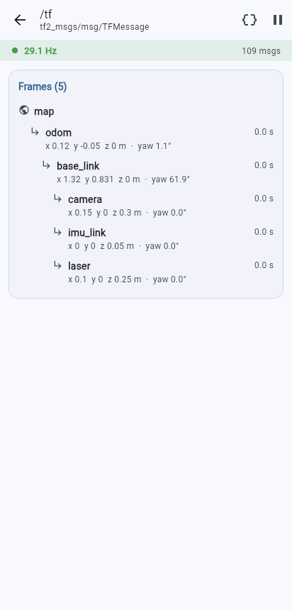

### Publish
- **Joystick** for `Twist` / `TwistStamped` topics. Commands are sent at 10 Hz only while you hold the stick. Releasing it, pressing **STOP**, or leaving the screen sends zero velocity three times, and keeps retrying if the link is reconnecting. Maximum linear and turn speeds are adjustable.
- **JSON editor** for any message type. The template is generated from the message definition through `rosapi`, with Format and reset buttons. You can publish once or repeat at 1–10 Hz, and the app tells you when a message could not be sent.

**Demo:** publishing a topic in real time.

[](https://youtu.be/dDQ4CdB41EE)

### Node Graph
- A layered publisher → subscriber graph, sized to stay readable on a phone. Pan it sideways when it is wide.
- **Show in Graph** from a topic's actions highlights the nodes and edges that use it.
- Tap a node to see what it publishes and subscribes to, and open any of those topics.

### 3D Model Viewer
- Open **STL** (binary or ASCII), **COLLADA (.dae)** or **URDF** files. Models are shown Z-up as in ROS and scaled to fit, with a ground grid and axis gizmo. Drag to orbit, pinch to zoom, use two fingers to pan, and double-tap to reset.
- For a URDF that uses meshes, select the `.urdf` together with its `.stl`/`.dae` files. They are matched by file name, and `<mesh scale>` is applied. Missing meshes are listed and can be added afterwards.
- URDF colors (inline and named materials) are applied. Move joints with sliders (degrees, or meters for prismatic joints) and highlight individual links.
- xacro files are detected, and the viewer shows the `xacro` command that converts them.
- Tested with the TurtleBot3 Burger URDF and meshes (~150k triangles) and the R2D2 model from `urdf_tutorial`.

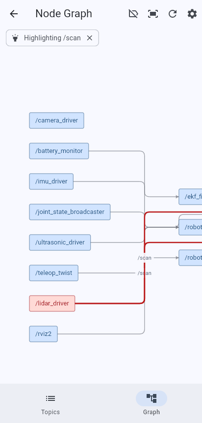 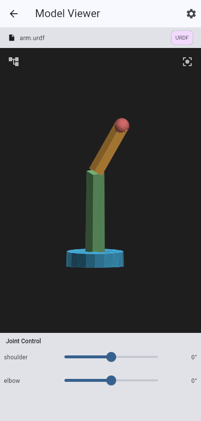 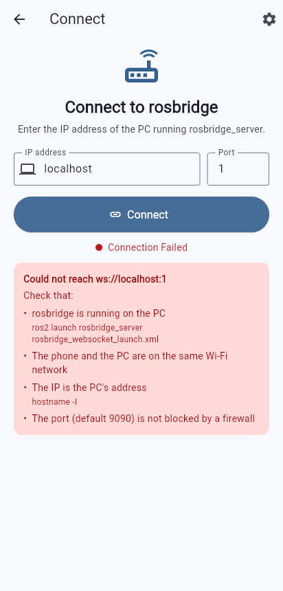 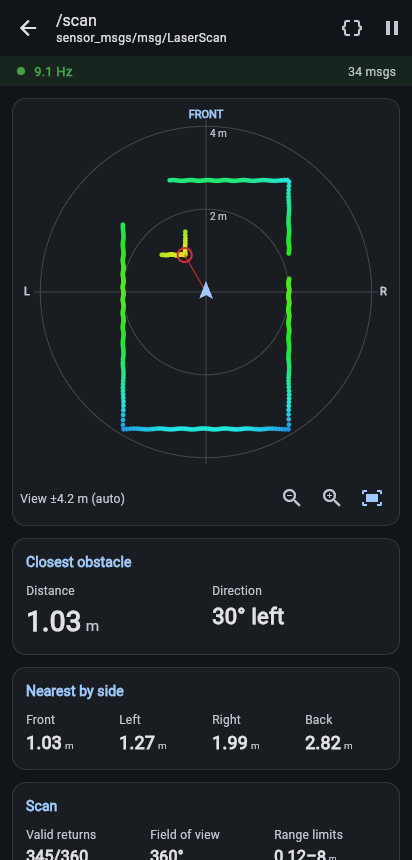

---

## Setup (ROS2 side)

Install rosbridge:
```bash
sudo apt install ros-humble-rosbridge-suite
```

Launch the WebSocket server. This launch file also starts `rosapi`, which the app uses for the topic list, the node graph, and publish templates.
```bash
ros2 launch rosbridge_server rosbridge_websocket_launch.xml
```

The default port is **9090**. The phone and the robot PC must be on the same network. To find the PC's IP address, run `hostname -I`.

---

## Build from Source

Requires Flutter (stable) and the Android SDK.

```bash
git clone https://github.com/PolyGon-13/Robotics-Tool.git
cd Robotics-Tool
flutter pub get
flutter run
```

Release APK:
```bash
flutter build apk --release
```

Release AAB (for Play Store):
```bash
flutter build appbundle --release
```

Every push is built by GitHub Actions (analyze, tests, debug APK). The APK can be downloaded from the run's **Artifacts** section and installed on a phone for testing.

---

## Development

```bash
flutter analyze
flutter test
```

`tool/e2e/` contains a fake rosbridge server that simulates a small robot with 17 topics, plus browser-driven checks. They screenshot every screen (including at 360 dp) and test reconnects, dead links, stale data, and the joystick. No ROS2 install or Android device is needed. See [tool/e2e/README.md](tool/e2e/README.md).

The development plan and audit notes are in [docs/DEVELOPMENT_PLAN.md](docs/DEVELOPMENT_PLAN.md).

---

## Developer

**PolyGon**
